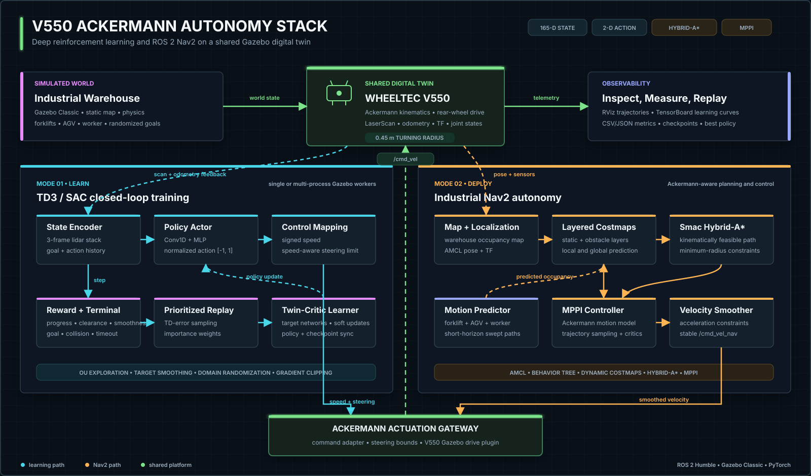

# V550 Ackermann DRL-Nav2

An end-to-end autonomous-navigation workspace for the **WHEELTEC V550 Ackermann**
robot, combining deep reinforcement learning (TD3/SAC) with a production-style
ROS 2 Nav2 stack in Gazebo Classic. The repository covers training, evaluation,
industrial warehouse simulation, dynamic-obstacle prediction, Ackermann-aware
planning and control, and ready-to-use model checkpoints.

**Author and maintainer:** [Jacob_Tan](https://github.com/Jacob-Tan666)


## Demonstrations

### Industrial Nav2 navigation

The V550 follows feasible Ackermann paths through a warehouse while Nav2 tracks
static infrastructure and predicted motion from forklifts, an AGV, and a worker.

<p align="center">
  
</p>

### TD3 reinforcement-learning navigation

The V550 learns collision-free point-to-point navigation from lidar observations,
relative goal geometry, and recent control history.

<p align="center">
  
</p>

## Highlights

- **V550-specific simulation:** separate lightweight training and detailed
  industrial URDF/SDF variants, meshes, sensors, steering joints, and rear-wheel
  drive dynamics.
- **Ackermann-aware Nav2:** Smac Hybrid-A* global planning, MPPI local control with
  the Ackermann motion model, velocity smoothing, and a shared `0.45 m` minimum
  turning radius.
- **Dynamic warehouse traffic:** deterministic routes for two forklifts, one AGV,
  and one worker, including robot/obstacle clearance checks and short-horizon
  swept-path point-cloud prediction.
- **Modernized TD3 pipeline:** temporal lidar stacking, a 1-D convolutional
  actor/critic, Ornstein-Uhlenbeck exploration, prioritized replay, target-policy
  smoothing, gradient clipping, checkpoint resume, and best-model selection.
- **Single and parallel training:** one-command single-environment training or
  isolated multi-process Gazebo workers using separate ROS domain IDs and Gazebo
  master ports.
- **Simulation-to-reality robustness:** optional observation noise, action delay,
  actuator-response variation, drag variation, sensor bias, and progressive domain
  randomization.
- **Repeatable evaluation:** fixed evaluation scenarios, trajectory markers,
  success/collision/timeout metrics, and CSV/JSON result export.

## System Architecture

<p align="center">
  <a href="./docs/assets/system-architecture.svg">
    
  </a>
</p>

Both autonomy modes share the same V550 sensor, kinematic, and actuation
boundaries. The learning path closes the loop through prioritized replay and
twin-critic policy updates; the Nav2 path combines predicted dynamic occupancy
with Hybrid-A* planning and MPPI control before reaching the shared drive plugin.

### DRL state, action, and reward

With the default `SCAN_BINS=50` and `FRAME_STACK=3`, the TD3 state has 165 values:
50 minimum-pooled lidar bins plus five kinematic values per frame (normalized goal
distance, goal-bearing cosine/sine, previous speed, and previous steering). The
actor outputs two values in `[-1, 1]`, which the environment maps to signed vehicle
speed and a speed-dependent steering limit.

The reward combines goal progress and motion alignment with penalties for poor
clearance, high-speed curvature, abrupt steering, stagnation, and elapsed time.
Goals and collisions produce terminal rewards of `+200` and `-200`; timeouts add a
configurable penalty.

### Parallel training data flow

Each sampling worker owns an isolated Gazebo/ROS 2 environment and an inference-only
actor. Workers send transitions to one learner process, which owns the replay buffer,
optimizers, TensorBoard writer, evaluation environment, and checkpoints. The learner
periodically publishes the latest actor weights back to every worker.

### Industrial navigation data flow

The industrial launch starts Gazebo, robot-state publishing, AMCL, Nav2 servers,
dynamic obstacles, command conversion, TF synchronization, trajectory history, and
RViz. Dynamic-obstacle predictions are added to both local and global costmaps.
Nav2 publishes smoothed velocity commands on `/cmd_vel_nav`; the adapter converts
`angular.z` to a bounded steering angle before publishing `/cmd_vel` to the V550
Gazebo plugin.

## Repository Layout

```text
.
|-- README.md                          Project documentation and demonstrations
|-- LICENSE                            Project-level MIT license
|-- V550_AKM_工业动态复杂场景_3x.gif    Industrial Nav2 demonstration
|-- V550_AKM_RL.gif                    TD3 training/evaluation demonstration
|-- pyproject.toml / poetry.lock       Python dependency and tooling metadata
|-- run_industrial_nav2.sh             Industrial Nav2 launcher
|-- run_single_train.sh                Single-environment TD3 training
|-- run_multi_train.sh                 Multi-process TD3 training
|-- run_td3_test.sh                    Checkpoint evaluation and report export
|-- src/
|   |-- drl_navigation_ros2/           Environment, TD3/SAC, replay, train/test code
|   |   |-- TD3/                       Conv1D actor, twin critic, OU noise, checkpoints
|   |   |-- SAC/                       Soft Actor-Critic implementation
|   |   `-- models/                    V550 checkpoints and evaluation results
|   |-- v550_ackermann_description/    V550 URDF variants and RViz description
|   `-- v550_ackermann_simulations/
|       `-- v550_ackermann_gazebo/     Gazebo/Nav2 package, worlds, maps and assets
`-- tests/                              Lightweight Python tests
```

The repository intentionally excludes local Colcon outputs, Gazebo logs, TensorBoard
runs, IDE state, duplicate scratch files, and raw screen recordings.

## Requirements

The current launch scripts and Nav2 configuration target the following environment:

- Ubuntu 22.04
- ROS 2 Humble
- Gazebo Classic 11 and `gazebo_ros_pkgs`
- Nav2, including Smac Planner and MPPI Controller
- Python 3.10
- PyTorch 2.x; CUDA is optional but recommended for parallel training
- Colcon, rosdep, Poetry, and TensorBoard

> The project descends from a ROS 2 Foxy research codebase, but this V550 version is
> configured and tested around ROS 2 Humble. Do not mix Foxy and Humble workspaces.

## Installation

### 1. Clone the repository

```bash
git clone https://github.com/Jacob-Tan666/V550-Ackermann-DRL-Nav2.git
cd V550-Ackermann-DRL-Nav2
```

### 2. Install ROS 2 dependencies

Install ROS 2 Humble first, then install the workspace dependencies:

```bash
sudo apt update
sudo apt install -y \
  python3-colcon-common-extensions \
  python3-rosdep \
  ros-humble-gazebo-ros-pkgs \
  ros-humble-navigation2 \
  ros-humble-nav2-bringup \
  ros-humble-nav2-mppi-controller

sudo rosdep init  # Skip this line if rosdep is already initialized.
rosdep update
rosdep install --from-paths src --ignore-src -r -y --rosdistro humble
```

### 3. Install Python dependencies

The lockfile is managed with Poetry. A virtual environment with system site packages
keeps ROS 2 Python modules such as `rclpy` visible:

```bash
python3 -m venv --system-site-packages .venv
source .venv/bin/activate
python -m pip install --upgrade pip poetry
poetry install
```

For a minimal runtime-only setup, install PyTorch for your CPU/CUDA platform first,
then install `numpy`, `PyYAML`, `squaternion`, `tensorboard`, `tqdm`, `pandas`, and
`matplotlib`.

### 4. Build and source the workspace

```bash
source /opt/ros/humble/setup.bash
colcon build --symlink-install
source install/setup.bash

export DRLNAV_BASE_PATH="$PWD"
export GAZEBO_MODEL_PATH="${GAZEBO_MODEL_PATH:+${GAZEBO_MODEL_PATH}:}$PWD/src/v550_ackermann_simulations/v550_ackermann_gazebo/models"
```

Run the `source` and `export` commands in every new terminal, or adapt
`src/test.env` to your shell initialization.

## Running the Project

### Industrial warehouse navigation

```bash
source .venv/bin/activate
source /opt/ros/humble/setup.bash
source install/setup.bash
./run_industrial_nav2.sh
```

Use **2D Pose Estimate** in RViz if localization needs initialization, then use
**2D Goal Pose** to send a goal. The default launch opens Gazebo and RViz, enables
dynamic obstacles, and arranges both windows side by side.

Useful overrides:

```bash
# Disable moving traffic.
DYNAMIC_OBSTACLES=false ./run_industrial_nav2.sh

# Increase obstacle route speed by 50%.
DYNAMIC_SPEED_SCALE=1.5 ./run_industrial_nav2.sh

# Run headless without RViz.
INDUSTRIAL_GUI=false INDUSTRIAL_RVIZ=false ./run_industrial_nav2.sh
```

Direct launch invocation is also supported:

```bash
ros2 launch v550_ackermann_gazebo industrial_navigation.launch.py \
  gui:=true rviz:=true dynamic_obstacles:=true
```

### Single-environment TD3 training

```bash
source .venv/bin/activate
./run_single_train.sh
```

This starts one Gazebo environment on `ROS_DOMAIN_ID=1`, waits for the required
services and sensor topics, and then runs `train_single.py`.

### Parallel TD3 training

```bash
source .venv/bin/activate
NUM_WORKERS=8 VIS_WORKER_ID=1 ./run_multi_train.sh
```

Workers use ROS domain IDs `1..NUM_WORKERS`; the dedicated evaluation environment
uses domain ID `99`. `NUM_WORKERS` defaults to the available CPU count capped by
`MAX_AUTO_WORKERS=16`.

### Evaluate a checkpoint

```bash
source .venv/bin/activate
TEST_MODEL_NAME=TD3_best TEST_EPISODES=10 ./run_td3_test.sh
```

Results are written as CSV and JSON under
`src/drl_navigation_ros2/models/TD3/test_results/`. RViz-compatible trajectory
markers are published during evaluation.

### TensorBoard

```bash
tensorboard --logdir runs
```

Open `http://localhost:6006` to inspect training and evaluation metrics.

## Key Configuration

The launcher scripts expose the most important settings as environment variables:

| Variable | Default | Purpose |
| --- | ---: | --- |
| `SCAN_BINS` | `50` | Number of minimum-pooled lidar sectors per frame |
| `FRAME_STACK` | `3` | Number of observation frames in each TD3 state |
| `NUM_WORKERS` | auto, max `16` | Parallel Gazebo sampling processes |
| `BATCH_SIZE` | `512` multi / `256` single | Learner minibatch size |
| `START_TIMESTEPS` | `20000` | Uniform-random warm-up transitions |
| `MAX_TOTAL_STEPS` | `2000000` | Multi-process environment-step budget |
| `MAX_STEPS` | `200` | Training episode limit |
| `EVAL_MAX_STEPS` | `250` | Evaluation episode limit |
| `REPLAY_STRATEGY` | `per` | Prioritized (`per`) or uniform replay |
| `RESUME_MODEL` | `0` | Resume actor, critics, optimizers, and metadata |
| `MODEL_DIR` | `src/drl_navigation_ros2/models/TD3` | Checkpoint directory |
| `DYNAMIC_OBSTACLES` | mode-specific | Enable warehouse moving traffic |
| `DYNAMIC_SPEED_SCALE` | `1.0` | Dynamic-obstacle route speed multiplier |

Additional exploration, prioritized-replay, noise, action-delay, and domain-
randomization parameters are documented directly in `run_multi_train.sh` and
`run_single_train.sh` with executable defaults.

## Models and Outputs

The `models/TD3` directory contains current and best TD3 checkpoints. A complete
checkpoint consists of actor, actor target, critic, critic target, and trainer state
files. The trainer state stores optimizer state, iteration count, environment steps,
and best-evaluation metadata. `models/TD3_warehouse` contains the warehouse-specific
checkpoint set.

Generated artifacts are kept out of version control:

- `runs/`: TensorBoard event files
- `gazebo_logs/`: launcher and worker logs
- `build/`, `install/`, `log/`: Colcon outputs
- `*.webm`: raw screen recordings

## Validation

Run the lightweight Python tests:

```bash
source .venv/bin/activate
pytest -q
```

Build and test the ROS 2 packages:

```bash
source /opt/ros/humble/setup.bash
colcon build --symlink-install
colcon test --event-handlers console_direct+
colcon test-result --verbose
```

Full navigation and learning validation requires Gazebo because the environment
depends on `/scan`, `/odom`, `/gazebo/model_states`, and Gazebo control services.

## License and Attribution

Project-level Python and orchestration code is distributed under the
[MIT License](./LICENSE). V550 description/simulation components derived from
ROBOTIS and Gazebo ROS retain their Apache-2.0 notices. Vendored warehouse assets
from [AWS RoboMaker Small Warehouse World](https://github.com/aws-robotics/aws-robomaker-small-warehouse-world)
retain the upstream license at
`src/v550_ackermann_simulations/v550_ackermann_gazebo/models/AWS_ROBOMAKER_SMALL_WAREHOUSE_LICENSE.txt`.

This project builds on the following open-source work:

- ROS 2 navigation adaptation: [tomasvr/turtlebot3_drlnav](https://github.com/tomasvr/turtlebot3_drlnav)
- TD3 navigation baseline: [reiniscimurs/DRL-robot-navigation](https://github.com/reiniscimurs/DRL-robot-navigation)
- SAC implementation: [denisyarats/pytorch_sac](https://github.com/denisyarats/pytorch_sac)
- V550/robot-description heritage: [ROBOTIS-GIT](https://github.com/ROBOTIS-GIT)

Copyright notices and licenses from upstream components remain in their respective
files and directories.
