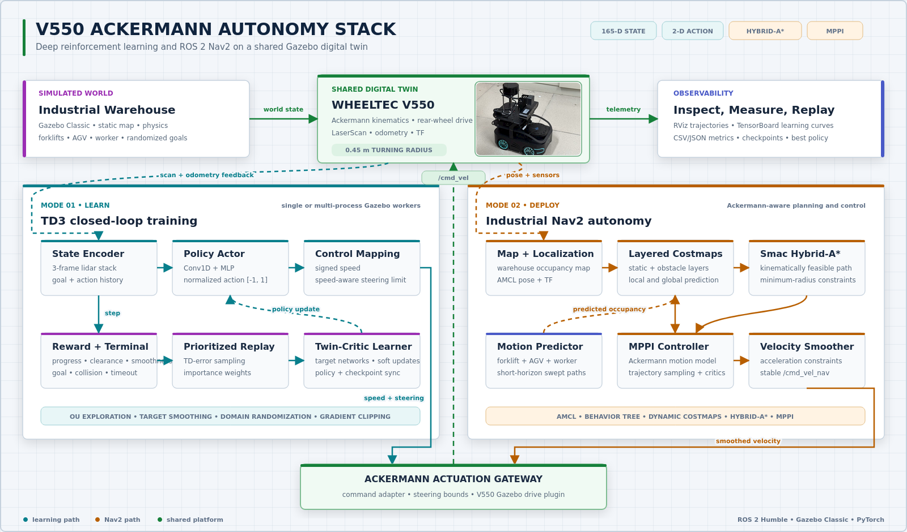
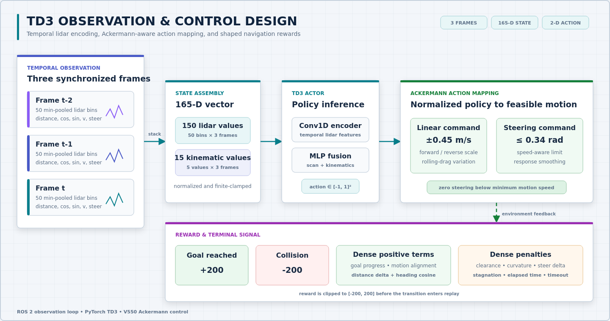
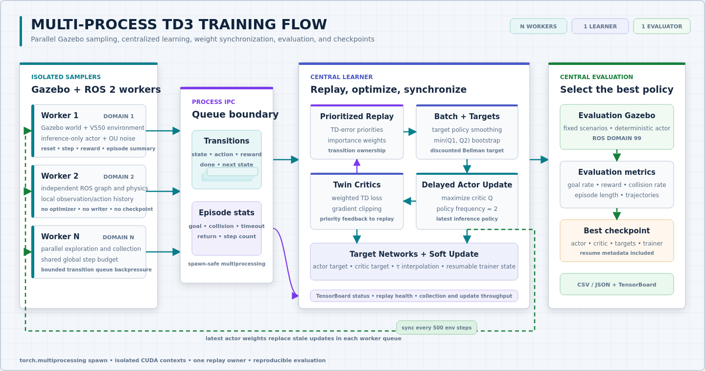
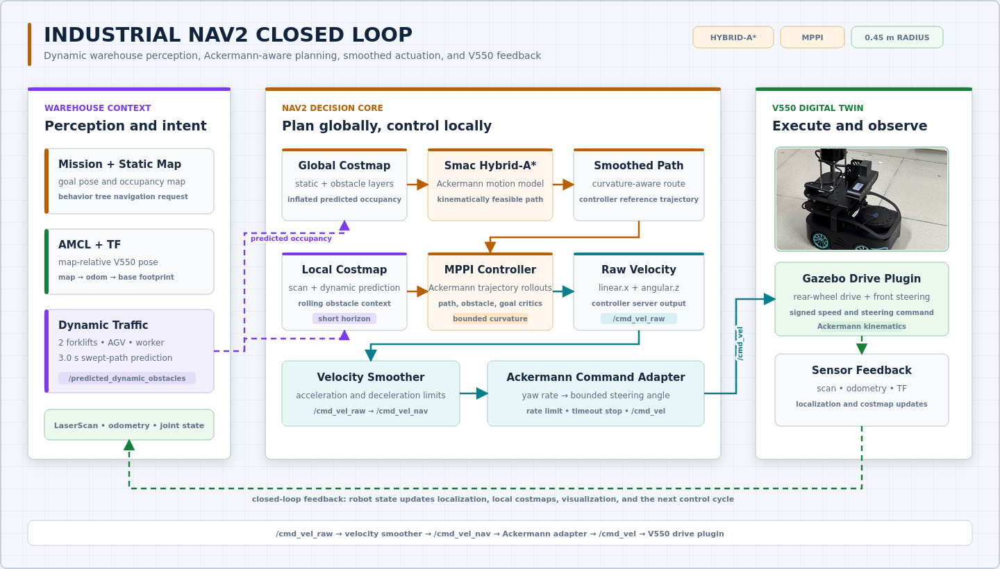

<div align="center">

**简体中文** | [English](./README_EN.md)

</div>

# V550 Ackermann DRL-Nav2

面向 **WHEELTEC V550 Ackermann** 小车的端到端自主导航工作空间，集成 TD3 深度强化学习、ROS 2 Nav2 与 Gazebo Classic。项目覆盖单环境及并行训练、模型评估、工业仓储仿真、动态障碍物预测、Ackermann 运动学约束规划与控制，并提供可直接使用的模型权重和评估结果。

**作者与维护者：** [Jacob_Tan](https://github.com/Jacob-Tan666)


**检索关键词：** V550 Ackermann 自主导航、ROS 2 Humble、Nav2、TD3 深度强化学习、Gazebo 机器人仿真、阿克曼转向、工业仓储导航、动态避障。

## 项目演示

### 工业动态场景 Nav2 导航

V550 在仓储环境中执行满足 Ackermann 约束的路径跟踪。Nav2 同时处理静态设施以及叉车、AGV 和行人的短时运动预测，并将预测结果融合到局部与全局代价地图。

<p align="center">
  
</p>

### TD3 强化学习导航

V550 根据激光雷达观测、目标相对几何关系和近期控制历史，学习无碰撞的点到点导航策略。

<p align="center">
  
</p>

## 核心特性

- **V550 专用仿真模型：** 提供轻量训练版与工业导航版 URDF/SDF，包含车体网格、激光雷达、转向关节和后轮驱动动力学。
- **Ackermann 感知 Nav2：** 使用 Smac Hybrid-A* 全局规划器、Ackermann 运动模型 MPPI 控制器和速度平滑器，并统一采用 `0.45 m` 最小转弯半径。
- **动态仓储交通：** 支持两台叉车、一台 AGV 和一名行人的确定性路线，包含机器人避让、障碍物间距约束及短时扫掠路径点云预测。
- **现代化 TD3 训练链路：** 采用时序雷达帧堆叠、Conv1D actor/critic、OU 探索噪声、优先经验回放、目标策略平滑、梯度裁剪、断点续训和最优模型选择。
- **单环境与并行训练：** 可启动单个 Gazebo 环境，也可通过独立 ROS Domain ID 与 Gazebo Master 端口运行多进程采样。
- **仿真到实机鲁棒性：** 可配置观测噪声、动作延迟、执行器响应、滚动阻力、传感器偏置和渐进式域随机化。
- **可复现实验评估：** 支持固定评估场景、RViz 轨迹标记、成功/碰撞/超时统计，以及 CSV/JSON 结果导出。

## 系统架构

<p align="center">
  <a href="./docs/assets/system-architecture.png">
    
  </a>
</p>

TD3 与 Nav2 两条自主导航路径共享同一套 V550 传感器、运动学和执行边界。学习路径通过优先经验回放与双 critic 更新形成闭环；工业导航路径将动态占用预测、Hybrid-A* 路径规划和 MPPI 控制串联后，经统一的 Ackermann 指令适配器驱动 Gazebo 小车。

### TD3 状态、动作与奖励

<p align="center">
  <a href="./docs/assets/td3-state-action-reward.png">
    
  </a>
</p>

默认 `SCAN_BINS=50`、`FRAME_STACK=3` 时，状态空间包含 165 个数值：每帧 50 个最小池化雷达扇区，以及归一化目标距离、目标方向余弦/正弦、上一时刻速度和转向角共 5 个运动学量。Actor 输出两个 `[-1, 1]` 范围内的动作，环境将其映射为有符号车速和随速度变化的转向上限。

奖励函数综合目标距离进展、运动方向一致性与安全间距，并对高速大曲率、突变转向、停滞和时间消耗施加惩罚。到达目标和发生碰撞对应 `+200` 与 `-200` 的终止奖励，超时惩罚可通过环境变量配置。

### 并行训练数据流

<p align="center">
  <a href="./docs/assets/parallel-training-flow.png">
    
  </a>
</p>

每个采样进程独占一个 Gazebo/ROS 2 环境和仅用于推理的 Actor。采样进程将 transition 发送给唯一的 learner；learner 负责经验回放、优化器、TensorBoard、评估环境和检查点，并周期性向各采样进程广播最新 Actor 参数。

### 工业导航数据流

<p align="center">
  <a href="./docs/assets/industrial-nav2-flow.png">
    
  </a>
</p>

工业导航入口会启动 Gazebo、robot state publisher、AMCL、Nav2 服务、动态障碍物、速度指令转换、TF 同步、轨迹记录和 RViz。Nav2 将平滑后的速度发布到 `/cmd_vel_nav`；适配器把 `angular.z` 转换为有界转向角，再通过 `/cmd_vel` 发送给 V550 Gazebo 驱动插件。

## 目录结构

```text
.
|-- README.md                          中文项目文档（默认）
|-- README_EN.md                       English documentation
|-- LICENSE                            项目级 MIT 许可证
|-- V550_AKM_工业动态复杂场景_3x.gif    工业 Nav2 演示
|-- V550_AKM_RL.gif                    TD3 训练与评估演示
|-- pyproject.toml / poetry.lock       Python 依赖与工具配置
|-- run_industrial_nav2.sh             工业 Nav2 启动脚本
|-- run_single_train.sh                单环境 TD3 训练脚本
|-- run_multi_train.sh                 多进程 TD3 训练脚本
|-- run_td3_test.sh                    模型评估与结果导出脚本
|-- docs/assets/                       架构图与展示资源
|-- src/
|   |-- drl_navigation_ros2/           环境、TD3、经验回放及训练/测试代码
|   |   |-- TD3/                       Conv1D Actor、双 Critic 与 OU 噪声
|   |   `-- models/                    V550 模型权重与评估结果
|   |-- v550_ackermann_description/    V550 URDF 与 RViz 描述包
|   `-- v550_ackermann_simulations/
|       `-- v550_ackermann_gazebo/     Gazebo/Nav2 包、地图、世界与模型资源
`-- tests/                              核心 Python 逻辑测试
```

仓库通过 `.gitignore` 排除 Colcon 构建结果、Gazebo 日志、TensorBoard 运行记录、IDE 状态、临时副本和原始录屏文件。

## 环境要求

- Ubuntu 22.04
- ROS 2 Humble
- Gazebo Classic 11 与 `gazebo_ros_pkgs`
- Nav2（包含 Smac Planner 和 MPPI Controller）
- Python 3.10
- PyTorch 2.x；并行训练推荐使用 CUDA
- Colcon、rosdep、Poetry 与 TensorBoard

> 项目源自 ROS 2 Foxy 研究代码，但当前 V550 版本按 ROS 2 Humble 配置和验证。请勿在同一个工作空间中混用 Foxy 与 Humble。

## 安装

### 1. 克隆仓库

```bash
git clone https://github.com/Jacob-Tan666/V550-Ackermann-DRL-Nav2.git
cd V550-Ackermann-DRL-Nav2
```

### 2. 安装 ROS 2 依赖

先完成 ROS 2 Humble 安装，然后执行：

```bash
sudo apt update
sudo apt install -y \
  python3-colcon-common-extensions \
  python3-rosdep \
  ros-humble-gazebo-ros-pkgs \
  ros-humble-navigation2 \
  ros-humble-nav2-bringup \
  ros-humble-nav2-mppi-controller

sudo rosdep init  # 已初始化 rosdep 时跳过此行
rosdep update
rosdep install --from-paths src --ignore-src -r -y --rosdistro humble
```

### 3. 安装 Python 依赖

项目使用 Poetry 管理锁定依赖。创建带系统 site-packages 的虚拟环境，可继续访问 ROS 2 提供的 `rclpy` 等模块：

```bash
python3 -m venv --system-site-packages .venv
source .venv/bin/activate
python -m pip install --upgrade pip poetry
poetry install
```

开发与测试环境使用：

```bash
poetry install --with dev,tests,linters
```

### 4. 构建并加载工作空间

```bash
source /opt/ros/humble/setup.bash
colcon build --symlink-install
source install/setup.bash

export DRLNAV_BASE_PATH="$PWD"
export GAZEBO_MODEL_PATH="${GAZEBO_MODEL_PATH:+${GAZEBO_MODEL_PATH}:}$PWD/src/v550_ackermann_simulations/v550_ackermann_gazebo/models"
```

每次打开新终端后均需重新执行 `source` 与 `export`，也可以根据实际环境调整 `src/test.env`。

## 运行方式

### 工业仓储导航

```bash
source .venv/bin/activate
source /opt/ros/humble/setup.bash
source install/setup.bash
./run_industrial_nav2.sh
```

如定位尚未初始化，在 RViz 中先使用 **2D Pose Estimate** 设置初始位姿，再通过 **2D Goal Pose** 发送目标。默认入口会启动 Gazebo、RViz 和动态障碍物，并自动排列可视化窗口。

常用覆盖参数：

```bash
# 关闭动态交通参与者
DYNAMIC_OBSTACLES=false ./run_industrial_nav2.sh

# 将动态障碍物路线速度提高 50%
DYNAMIC_SPEED_SCALE=1.5 ./run_industrial_nav2.sh

# 无 Gazebo GUI、无 RViz 运行
INDUSTRIAL_GUI=false INDUSTRIAL_RVIZ=false ./run_industrial_nav2.sh
```

也可以直接调用 ROS 2 launch：

```bash
ros2 launch v550_ackermann_gazebo industrial_navigation.launch.py \
  gui:=true rviz:=true dynamic_obstacles:=true
```

### 单环境 TD3 训练

```bash
source .venv/bin/activate
./run_single_train.sh
```

脚本在 `ROS_DOMAIN_ID=1` 上启动一个 Gazebo 环境，等待控制服务与传感器话题就绪后运行 `train_single.py`。

### 并行 TD3 训练

```bash
source .venv/bin/activate
NUM_WORKERS=8 VIS_WORKER_ID=1 ./run_multi_train.sh
```

采样进程默认使用 `1..NUM_WORKERS` 的 ROS Domain ID，独立评估环境使用 Domain ID `99`。未设置 `NUM_WORKERS` 时，脚本根据 CPU 核心数自动选择，最大不超过 `MAX_AUTO_WORKERS=16`。

### 模型评估

```bash
source .venv/bin/activate
TEST_MODEL_NAME=TD3_best TEST_EPISODES=10 ./run_td3_test.sh
```

评估结果会写入 `src/drl_navigation_ros2/models/TD3/test_results/`，同时发布可在 RViz 中查看的轨迹标记。

### TensorBoard

```bash
tensorboard --logdir runs
```

打开 `http://localhost:6006` 查看训练与评估曲线。

## 关键配置

| 环境变量 | 默认值 | 作用 |
| --- | ---: | --- |
| `SCAN_BINS` | `50` | 每帧最小池化雷达扇区数量 |
| `FRAME_STACK` | `3` | TD3 状态中的时序帧数 |
| `NUM_WORKERS` | 自动，最大 `16` | 并行 Gazebo 采样进程数量 |
| `BATCH_SIZE` | 并行 `512` / 单环境 `256` | learner 批大小 |
| `START_TIMESTEPS` | `20000` | 均匀随机动作预热步数 |
| `MAX_TOTAL_STEPS` | `2000000` | 并行训练环境步数上限 |
| `MAX_STEPS` | `200` | 单个训练 episode 最大步数 |
| `EVAL_MAX_STEPS` | `250` | 单个评估 episode 最大步数 |
| `REPLAY_STRATEGY` | `per` | 优先经验回放 `per` 或均匀回放 |
| `RESUME_MODEL` | `0` | 是否恢复模型、优化器和训练元数据 |
| `MODEL_DIR` | `src/drl_navigation_ros2/models/TD3` | 检查点目录 |
| `DYNAMIC_OBSTACLES` | `true`（工业导航） | 是否启用仓储动态交通 |
| `DYNAMIC_SPEED_SCALE` | `1.0` | 动态障碍物速度倍率 |

探索噪声、优先经验回放、观测噪声、动作延迟和域随机化参数均在 `run_multi_train.sh` 与 `run_single_train.sh` 中提供可执行默认值。

## 模型与输出

`models/TD3` 保存当前模型和最优 TD3 检查点。完整检查点由 Actor、Actor Target、Critic、Critic Target 与 Trainer 状态组成；Trainer 状态包含优化器、迭代次数、环境步数和最优评估元数据。`models/TD3_warehouse` 保存仓储场景专用权重。

以下运行时产物不会进入版本控制：

- `runs/`：TensorBoard 事件文件
- `gazebo_logs/`：启动器与采样进程日志
- `build/`、`install/`、`log/`：Colcon 输出
- `*.webm`：原始录屏

## 代码质量与验证

运行 Python 格式和静态检查：

```bash
make lint
```

运行核心逻辑测试：

```bash
make test
```

构建并测试 ROS 2 软件包：

```bash
source /opt/ros/humble/setup.bash
colcon build --symlink-install
colcon test --event-handlers console_direct+
colcon test-result --verbose
```

完整导航和学习验证需要 Gazebo，因为环境依赖 `/scan`、`/odom`、`/gazebo/model_states` 以及 Gazebo 控制服务。

## 许可证与开源归属

项目级 Python 与编排代码采用 [MIT License](./LICENSE)。源自 ROBOTIS 和 Gazebo ROS 的 V550 描述/仿真组件保留 Apache-2.0 声明。来自 [AWS RoboMaker Small Warehouse World](https://github.com/aws-robotics/aws-robomaker-small-warehouse-world) 的仓储资源保留上游许可证：

`src/v550_ackermann_simulations/v550_ackermann_gazebo/models/AWS_ROBOMAKER_SMALL_WAREHOUSE_LICENSE.txt`

本项目基于以下开源工作演进：

- ROS 2 导航适配：[tomasvr/turtlebot3_drlnav](https://github.com/tomasvr/turtlebot3_drlnav)
- TD3 导航基线：[reiniscimurs/DRL-robot-navigation](https://github.com/reiniscimurs/DRL-robot-navigation)
- V550/机器人描述基础：[ROBOTIS-GIT](https://github.com/ROBOTIS-GIT)

所有上游组件的版权和许可证声明均保留在对应文件与目录中。
